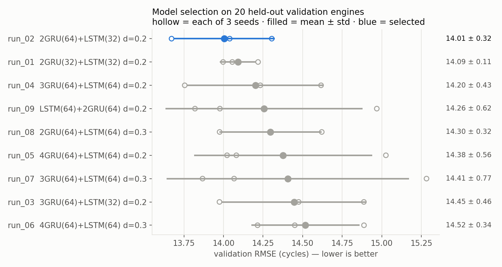
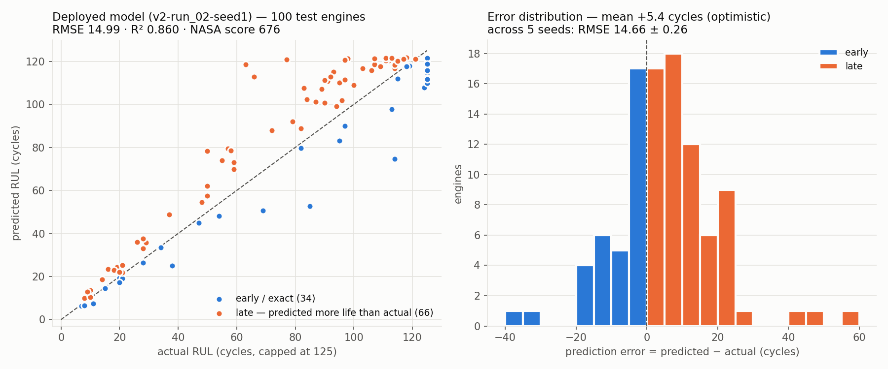

# Jet Engine RUL Prediction

[](https://github.com/Haadhi-Mohammed/jet-engine-rul/actions/workflows/ci.yml)

Predicts the **Remaining Useful Life (RUL)** of turbofan engines — how many flight cycles are
left before maintenance is needed — from their last 30 cycles of sensor data, and explains each
prediction with SHAP.

**Live:** [Fleet dashboard](https://huggingface.co/spaces/HaadhiMohammed/jet-engine-rul) ·
[API docs](https://jet-engine-rul-api.onrender.com/docs)
<sub>(the API runs on a free tier that sleeps when idle — the first load can take 1–3 minutes)</sub>

## Results

NASA CMAPSS FD001, 100 test engines, RUL capped at 125 cycles (standard for this benchmark):

| Metric | Mean ± std over 5 training seeds |
|---|---|
| RMSE | **14.66 ± 0.26** cycles |
| MAE | 10.77 ± 0.27 cycles |
| R² | 0.866 ± 0.005 |
| NASA score ([Saxena et al., 2008](#data)) | 488 ± 118 |

How these numbers were produced — and why they can be trusted:

- **Model selection never sees the test set.** 9 architectures × 3 seeds were compared on a
  validation split of **20 held-out engines**; the test set was loaded once, after every decision.
- **Split by engine, not by window.** Overlapping windows of one engine never appear on both sides.
- **Reported as mean ± std over seeds**, because a single run's score is partly luck — individual
  seeds of the same model range from 14.3 to 15.0 RMSE.
- **Reproducible:** fixed seeds and deterministic ops — rerunning gives identical results.

The deployed model is the seed with the best *validation* score (test RMSE 14.99, inside the normal
spread). An earlier version of this project reported RMSE 14.07; that model had been picked by
test-set score, which made the number optimistic — see `notebooks/03_training.ipynb`.



**Finding:** smaller is better here — 2 GRU layers match or beat the 3–4 layer stacks
(including the original dissertation architecture), but the top configurations are within
seed-to-seed noise of each other.



**Known limitation:** the model is optimistic on average (+5.4 cycles; 66 of 100 engines
get *more* predicted life than they have). In maintenance that is the risky direction —
an asymmetric loss is the natural next step.

## How it works

```
CMAPSS sensors ──► drop 7 flat sensors ──► RobustScaler ──► 30-cycle windows
                                                               │
     2 × GRU(64) ──► LSTM(32) ──► scaled dot-product self-attention ──► dense ──► RUL
                                                               │
                                          SHAP GradientExplainer ──► per-sensor importance
```

- **Data:** 14 informative sensors; training labels are RUL = cycles until failure, capped at 125
  (early-life cycles all look healthy, so they share one label).
- **Serving:** a FastAPI service (Render) loads the model, scaler and SHAP explainer.
  A Streamlit dashboard (Hugging Face Spaces) is a thin client over the API.
- **Alerts:** RUL < 30 → RED (immediate maintenance), < 60 → AMBER, otherwise GREEN.

### API

| Endpoint | What it returns |
|---|---|
| `GET /` | model, version, metrics, feature list, alert thresholds, valid input ranges |
| `GET /fleet` | all 100 test engines: predicted + actual RUL and alert level |
| `GET /engines/{id}/explain` | prediction + SHAP sensor importance for one engine |
| `GET /engines/{id}/sensors` | that engine's last 30 cycles (scaled) for charts |
| `POST /predict` | prediction + SHAP for 30 cycles of **raw** sensor readings you send |
| `GET /health` | liveness check |

`/predict` validates its input (exactly 30 cycles, no NaN/Infinity, readings within a plausible
range) and is rate-limited to 30 requests per minute per client.

## Project layout

```
rul/            shared package — config, preprocessing, model, metrics, attention layer
scripts/        train.py (experiment + final training), make_figures.py
api/            FastAPI service
dashboard/      Streamlit dashboard (deployed to Hugging Face by CI)
models/         deployed model + scaler + fleet data
tests/          pytest suite — API contract, input validation, pipeline reproducibility
notebooks/      original exploration and experiments (kept as a record)
reports/        figures and results (experiments_v2.csv, final_metrics.json)
```

## Run it locally

```bash
python -m venv venv
venv\Scripts\activate              # macOS/Linux: source venv/bin/activate
pip install -r requirements-api.txt -r requirements-dashboard.txt pytest httpx

uvicorn api.main:app --port 8001                          # API → http://localhost:8001/docs
RUL_API_URL=http://localhost:8001 streamlit run dashboard/app.py   # PowerShell: $env:RUL_API_URL="..."
python -m pytest                                          # tests
```

### Retrain

Download the [CMAPSS data](#data) into `data/raw/`, then:

```bash
python -m scripts.train experiment          # 9 configs × 3 seeds, ranked on validation (~1 h on CPU)
python -m scripts.train final --run run_02  # 5 seeds, one test evaluation, writes models/
python -m scripts.make_figures              # regenerate the figures above
mlflow ui --backend-store-uri sqlite:///mlflow.db   # browse every run
```

## Tech stack

TensorFlow/Keras · scikit-learn · SHAP · MLflow · FastAPI · Streamlit · Plotly · pytest ·
GitHub Actions (tests + dashboard deploy) · Render · Hugging Face Spaces

## Data

A. Saxena, K. Goebel, D. Simon, N. Eklund, *"Damage Propagation Modeling for Aircraft Engine
Run-to-Failure Simulation"*, PHM 2008. Dataset: NASA Prognostics Center of Excellence —
[CMAPSS Jet Engine Simulated Data](https://data.nasa.gov/dataset/cmapss-jet-engine-simulated-data).
The data is not included in this repository.

## Author

Haadhi Mohammed — MSc Data Science, Coventry University (Distinction).
Builds on my 2024/25 dissertation project.

Code released under the [MIT License](LICENSE).
